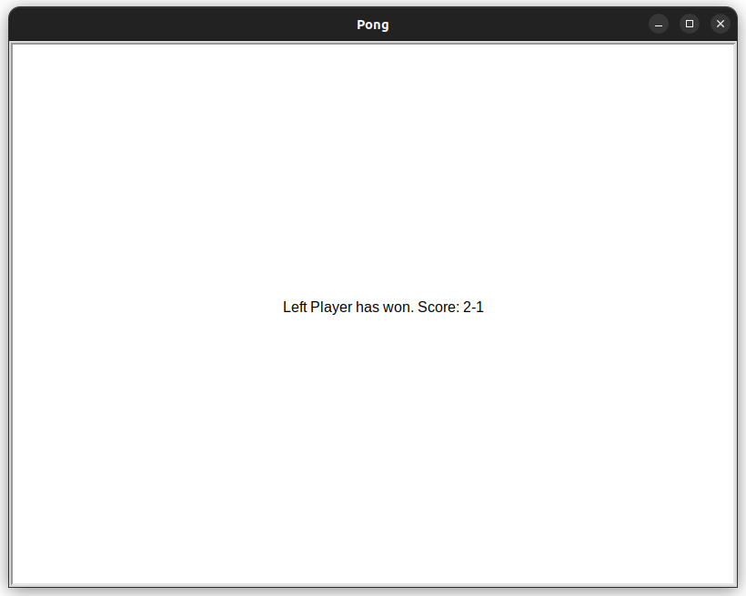

# Pong Game in Python

Tejas Acharya
[Twitter](https://twitter.com/achte_te)

Famous Pong Game in Python. Right player controls with Up and Down Arrow keys. Left player controls with 'W' and 'S' keys.

### Requirements:
[Turtle](https://docs.python.org/3/library/turtle.html)


To Run:
```sh
git clone git@github.com:achte-2022/Pong-Game.git
cd Pong-Game
python3 main.py
```

### Game Screen


### GAME OVER when one player's score is more than 11(Max. Score).

Here the Max. Score is 2(can be changed).



